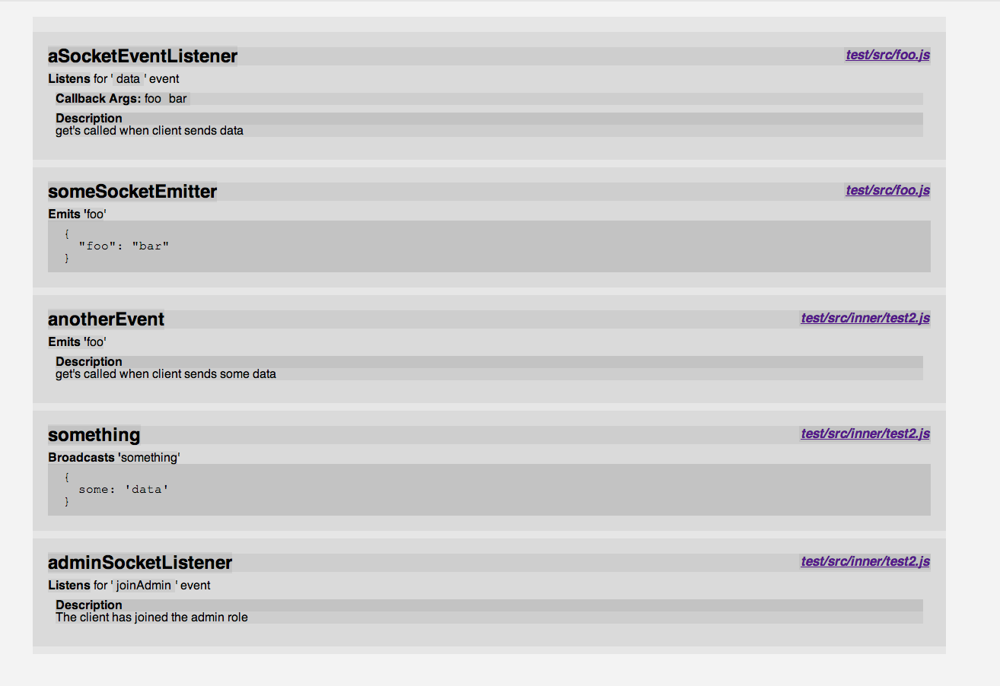

# Block Flow

Yet another documentation generator. This one, however, uses custom annotations to place emphasis on event-driven/streaming APIs. It also exposes your API data as an API. That's so meta.

## Install
blockflow is available as a command line tool or as a module which you can leverage from within your own code base.
To install the cli
```
[sudo] npm install -g blockflow
```

To install as an importable module
```
npm install blockflow --save
```


```javascript
/**
 * @listener aSocketEventListener
 * @topic foo
 * @description get's called when client sends data
 * @callbackArg fooObj
 */
socket.on('foo', function(fooObj){

});

```

```javascript
/**
 * @broadcaster something
 * @topic something
 * @snippet
 * {
 *   some: 'data'
 * }
 * @endsnippet
 */
socket.broadcast('something', { some: 'data' } );
```

## CLI Usage
```
blockflow -s path/to/src
```

The above generates the documentation in the default directory. The docs generated are very wireframey and should probably be styled according to your liking. To learn more about available options read below or just type the command itself with no options



```
blockflow
```

## Module Usage
```javascript
var blockflow = require( 'blockflow' );
var opts = {
  verbose: true
};

blockflow

  .from( '/path/to/src' )

  // returns an event emitter
  .flow( opts )

    // fired everytime a block is parsed and available...a "flow" of blocks :)
    .on('block', function( block ){

    })

    // fired when all blocks have been parsed
    // callback returns all blocks (in case you weren't listening)
    // in an array
    .on('end', function( srcRoot, allBlocks ){

    })
```

## API Mode
An API for your API
```
blockflow -s /path/to/src -a -p 8080 -e /docs
```

The above command will parse your docs, create a JSON object and expose it via a RESTful endpoint at
http://localhost:8080/docs

Still very alpha-ish at the moment. More docs and features coming soon.

## Options

| Option   | Flag   | Required | Default          | Desciption|
| -------- |:------:| :--------:|:----------------:|:----------
| Source   | -s 	 | Yes      | N/A              | The root of your source tree |
| out      | -o 	 | No       | ./blockflow_docs | Web output directory. |
| API Mode | -a 	 | No       | fasle            | Expose raw block data at a RESTful endpoint |
| Endpoint | -e 	 | No       | /blockflow       | The endpoint at which to expose raw block data |
| Port     | -p 	 | No       | 9000             | Port for the API mode server |
| Verbose  | -v 	 | No       | false            | Use verbose logging |


